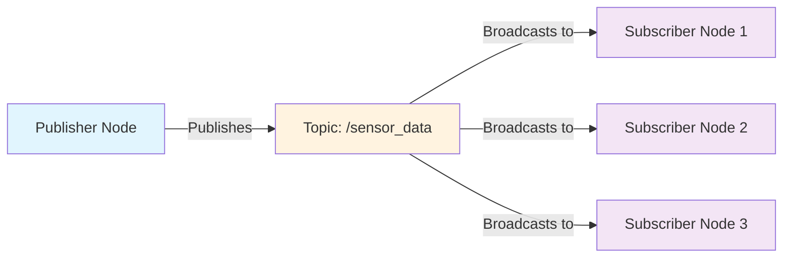
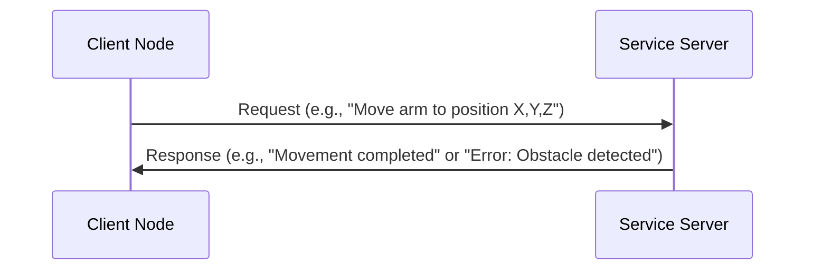
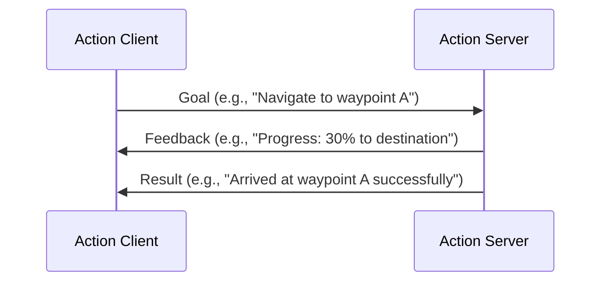

# Understanding the Graph: Nodes, Topics, & Services

## The Nervous System of Robotics

Imagine ROS 2 as the **nervous system** of your robot, where each component functions like a neuron in a biological nervous system. Just as neurons communicate through synapses to coordinate the body's actions, ROS 2 nodes communicate through topics and services to coordinate the robot's behavior.

In this analogy:
- **Nodes** are like neurons - individual processing units that perform specific functions
- **Topics** are like synaptic connections - pathways for continuous data flow
- **Messages** are like neurotransmitters - the actual information being transmitted
- **Services** are like reflex arcs - on-demand communication for specific requests

This distributed architecture allows your robot to scale from simple wheeled robots to complex humanoid systems while maintaining modularity and maintainability.

## The Publisher-Subscriber Pattern

The core communication paradigm in ROS 2 is the **publisher-subscriber pattern**, which enables asynchronous, decoupled communication between nodes. Let's visualize this relationship:



In this pattern:
- **Publishers** send data to a topic without knowing who will receive it
- **Subscribers** listen to specific topics without knowing who sent the data
- **Topics** act as channels that decouple publishers from subscribers
- Multiple nodes can publish to or subscribe from the same topic

## Deep Dive: DDS (Data Distribution Service)

DDS stands for **Data Distribution Service**, and it's the backbone that makes ROS 2's communication possible. Think of DDS as a sophisticated postal system for your robot:

### Key Characteristics of DDS:

1. **Discovery**: Nodes automatically discover each other on the network without configuration
2. **Reliability**: Guarantees message delivery with configurable quality of service settings
3. **Real-time Performance**: Designed for deterministic, low-latency communication
4. **Scalability**: Handles communication from single robots to fleets of robots
5. **Interoperability**: Allows different programming languages and systems to communicate

### Quality of Service (QoS) Profiles:

DDS provides QoS profiles that let you tune communication characteristics:

- **Reliability**: Reliable (guaranteed delivery) vs Best Effort (faster, occasional loss acceptable)
- **Durability**: Volatile (only new messages) vs Transient Local (historical data for late joiners)
- **History**: Keep All messages vs Keep Last N messages
- **Deadline**: Maximum time between consecutive messages

## Services: Request-Response Communication

While topics are perfect for continuous data streams (like sensor readings), services provide synchronous request-response communication for specific tasks:



Services are ideal for:
- Configuration requests
- Action execution
- Data queries
- Error reporting

## Parameters: Configuration Management

Parameters provide a centralized way to configure nodes at runtime:

```python
# Example parameter usage
self.declare_parameter('wheel_diameter', 0.15)
wheel_diam = self.get_parameter('wheel_diameter').value
```

## Actions: Goal-Based Communication

Actions combine the benefits of topics and services for long-running tasks:



## Practical Implementation

The ROS 2 graph is managed by the **ROS Master** (called the **ROS Daemon** in ROS 2), which coordinates node discovery and topic/service matching. Unlike ROS 1's central master, ROS 2 uses a distributed approach where nodes can discover each other directly using DDS.

:::warning
**Warning: Mixing ROS 1 and ROS 2**
Never attempt to directly connect ROS 1 and ROS 2 nodes without using the official ROS 1/ROS 2 bridge. The underlying communication architectures are fundamentally different and incompatible. While bridges exist for interoperability, mixing systems increases complexity and potential failure points.
:::

## Summary

Understanding the ROS 2 graph is crucial for effective robot development. The publisher-subscriber pattern enables modular, scalable robot architectures, while DDS provides the reliable communication backbone. By leveraging these concepts properly, you can build robots that are both powerful and maintainable.