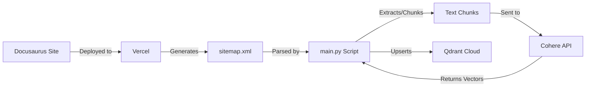

# Research & Technical Decisions

## Technical Context
The goal is to deploy the Docusaurus-based book website and create a pipeline to ingest its content into a vector database for RAG.

### Identified Unknowns & Clarifications
- **Deployment Platform**: The prompt specifies deployment to Vercel (based on the provided link `https://ai-native-book-psi.vercel.app/`), but requirements mention "public hosting provider".
  - *Decision*: We will use Vercel as it is the standard for Next.js/React apps (which Docusaurus is based on) and the user provided a Vercel link.
- **Embedding Model**: Spec mentions Cohere.
  - *Decision*: We will use `embed-english-v3.0` as it is the current standard for retrieval-augmented generation in English.
- **Vector Database**: Spec mentions Qdrant Cloud Free Tier.
  - *Decision*: We will use Qdrant Cloud. The free tier allows for a sufficient number of vectors for a single book.
- **Ingestion Logic**: The prompt specifies a single `main.py` file containing specific functions: `get_all_urls`, `extract_text_from_url`, `chunk_text`, `embed`, `create_collection`, `save_chunk_to_qdrant`.
  - *Decision*: We will strictly follow this structure in a `backend/main.py` file.

## Decisions

### 1. Backend Structure
- **Decision**: Create a `backend/` directory in the root.
- **Rationale**: Keeps the Python RAG logic separate from the Docusaurus frontend source.
- **Tooling**: Use `uv` for Python package management (as per prompt implication "initialize UV package").
  - *Alternatives*: `pip`, `poetry`. `uv` is faster and gaining traction for modern Python workflow management.

### 2. Website Deployment
- **Decision**: Deploy to Vercel.
- **Rationale**: User provided a Vercel URL `https://ai-native-book-psi.vercel.app/` as the target.
- **Method**: The deployment itself is likely handled via git push to the repo connected to Vercel, or a manual build command. For this task, we will ensure the project is buildable and provide instructions.

### 3. Embeddings & Vector Store
- **Provider**: Cohere (`embed-english-v3.0`).
- **Store**: Qdrant Cloud.
- **Collection Name**: `rag_embedding` (as specified in prompt).
- **Metadata**: `source_url`, `chunk_text` (implied by "retrieval-ready").

### 4. Text Processing & URL Discovery
- **URL Discovery**: Use `https://ai-native-book-psi.vercel.app/sitemap.xml` in `get_all_urls`.
  - *Rationale*: Docusaurus automatically generates a sitemap. Parsing XML is more reliable and faster than recursively crawling pages.
- **Extraction**: We will use `beautifulsoup4` to scrape text from the deployed URLs (as implied by `extract_text_from_url`).
- **Chunking**: We will use a recursive character text splitter (e.g., from `langchain-text-splitters` or custom implementation) to respect semantic boundaries.

## Architecture

